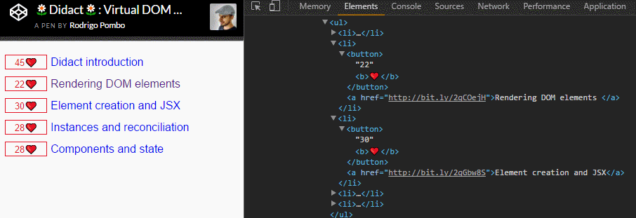

## 3. 实例-对比和虚拟DOM


> 这个故事是我们一步一步构建自己版本的React的系列文章的一部分：

到目前为止，我们实现了一个基于`JSX`描述-`创建dom元素`的机制。在这篇文章中，我们将重点介绍如何`更新DOM`。

直到我们`setState`在后面的文章中介绍时，`更新dom`的唯一方法是使用不同的元素再次调用`render函数`（[从第一篇文章开始](#1.3-渲染-dom-元素)）。例如，如果我们想`渲染一个时钟`，代码将是：

``` js
const rootDom = document.getElementById("root");

function tick() {
  const time = new Date().toLocaleTimeString();
  const clockElement = <h1>{time}</h1>;
  render(clockElement, rootDom);
}

tick();
setInterval(tick, 1000);
```

> [>>> codepen.io](https://codepen.io/pomber/pen/KmXeXr?editors=0010)

使用该函数的当前版本，这不起作用。而不是更新每个它相同的div 它会追加一个新的。

解决这个问题的第一种方法是`替换`每个更新的div。

在函数结束时，我们检查父项是否有任何子项，如果有，我们用新元素生成的dom替换它：`rendertick-render`

``` js
function render(element, parentDom) {  
  
  // ...
  // Create dom from element
  // ...
  
  // Append or replace dom
  if (!parentDom.lastChild) { // 有没有最后孩子阿
    parentDom.appendChild(dom);     
  } else {
    // 换了你的孩子, 就是这么～～
    parentDom.replaceChild(dom, parentDom.lastChild);    
  }
}  
```

对于这个小例子，这个解决方案运行良好，但对于更复杂的情况，重新创建所有子节点的性能成本是不可接受的。所以我们需要`一种方法来比较当前和前一次调用生成的元素树`->`render`，并只`更新差异`。

---

捋一捋:

分清有`-5-`种名称

1. 真实-html-树 
2. Didact 元素 `{type, props}`
3. 虚拟-Dom-树
  - 3.1 虚拟-dom-元素 `{ dom, element, childInstance }`
  - 3.2 虚拟-组件-元素 `{ dom, element, childInstance, publicInstance }`

---

### 3.1 虚拟DOM和对比

`React`称这种“差异化”[进程调节](https://facebook.github.io/react/docs/reconciliation.html)。

对于我们来说，首先我们需要保留-先前渲染的树-，以便我们可以将它与-新树-进行`比较`。

换句话说，我们将维护我们自己的-DOM版本，一个虚拟的DOM。

什么应该是这个-虚拟DOM-中的“`节点「node」`”？

一种选择是只使用`Didact Elements`，它们已经有一个props.children属性，允许我们`以树的形式`导航它们。

但是有两个问题，

- 一个是我们需要在`虚拟DOM的每个节点`上保留一个对`真实DOM节点`的引用，以便使对比更容易，我们更愿意保持这些元素不变。

- 第二个问题是（稍后-下一章节）我们将需要支持具有自己状态的`组件{Component}`，并且元素无法处理它。

### 3.2 实例-Instance

所以我们需要引入一个新的术语：`实例-Instance`。

一个实例-表示已呈现-给DOM的元素。

它是具有三个属性的纯JS对象：`element`，`dom`，和`childInstances`。

`element` -> `Didact 元素`

`dom` -> `html 元素`

`childInstances`是一个包含元素-子元素实例的数组。

> 请注意，我们在这里引用的实例与[Dan Abramov在React Components，Elements和Instances中使用的实例](https://medium.com/@dan_abramov/react-components-elements-and-instances-90800811f8ca)不同。他引用了`公共实例`，这是React在调用继承自类的构造函数时得到的`React.Component`。我们将在未来的帖子中将`公开实例`添加到`Didact`。

每个DOM节点都会有一个匹配的实例。协调算法的一个目标是尽可能避免-创建或删除实例。创建和删除实例意味着我们也将-修改DOM树，所以我们重新利用实例的`次数越多`，修改DOM树的`次数越少`。

### 3.3 重构

让我们重写我们的`render`函数，保持同样的协调算法，并添加一个`instantiate`函数来`创建`一个给定元素的-实例（及其子元素）：

``` js
// --------------- 运行一次 开始------
let rootInstance = null;

function render(element, container) {

  const prevInstance = rootInstance; // 1-虚拟dom主树干- == null
  const nextInstance = reconcile(container, prevInstance, element); 
  rootInstance = nextInstance; // 2-支树干- 领头啦
}

function reconcile(parentDom, instance, element) {
  if (instance == null) {
    // 一开始的 1-虚拟dom主树干- null
    const newInstance = instantiate(element); // 从一个·Didact元素·-> 实例
    parentDom.appendChild(newInstance.dom); // -html-元素添加
    return newInstance;
  } else {
    const newInstance = instantiate(element);
    parentDom.replaceChild(newInstance.dom, instance.dom);
    return newInstance;
  }
}

// --------------- 运行一次 结束------

// ------ 递归 - instantiate - 运行一次以上 -----
function instantiate(element) {
  const { type, props } = element;

  // Create DOM element
  const isTextElement = type === "TEXT ELEMENT";
  const dom = isTextElement
    ? document.createTextNode("")
    : document.createElement(type);

  // Add event listeners
  const isListener = name => name.startsWith("on");
  Object.keys(props).filter(isListener).forEach(name => {
    const eventType = name.toLowerCase().substring(2);
    dom.addEventListener(eventType, props[name]);
  });

  // Set properties
  const isAttribute = name => !isListener(name) && name != "children";
  Object.keys(props).filter(isAttribute).forEach(name => {
    dom[name] = props[name];
  });
// 1. dom 构造完成

  // Instantiate and append children
  const childElements = props.children || [];

// 2. 转折点-递归-孩子 -> 变 实例数组
  const childInstances = childElements.map(instantiate);
// 3. 获取 孩子-html-数组
  const childDoms = childInstances.map(childInstance => childInstance.dom);

// 4. 儿/女 加入 爸爸妈妈的怀抱, 「 html 组合 」
// 正如 -2- 所做的-递归本函数
// 所以-孙子/孙女-已经-加入-儿/女的怀抱了
  childDoms.forEach(childDom => dom.appendChild(childDom));

  const instance = { dom, element, childInstances };
  
// `element` -> `Didact 元素`

// `dom` -> `html 元素`

// `childInstances`是一个包含元素-子元素实例的数组。

  return instance;
}
```

`instantiate-代码`和`以前-render`一样，但是我们现在正在将最后一次调用的实例`-instance-`存储起来。而`render`我们将-实例化中的调节-功能分开。

为了重新使用DOM节点，我们需要一种方法来-更新DOM属性（className，style，onClick而无需创建一个`新的DOM节点`等）。因此，让我们将-当前设置属性的代码部分-提取为-更新它们的通用函数`updateDomProperties`：
 
``` js
function instantiate(element) {
  const { type, props } = element;

  // Create DOM element
  const isTextElement = type === "TEXT ELEMENT";
  const dom = isTextElement
    ? document.createTextNode("")
    : document.createElement(type);

  updateDomProperties(dom, [], props); // <------

  // Instantiate and append children
  const childElements = props.children || [];
  const childInstances = childElements.map(instantiate);
  const childDoms = childInstances.map(childInstance => childInstance.dom);
  childDoms.forEach(childDom => dom.appendChild(childDom));

  const instance = { dom, element, childInstances };
  return instance;
}

function updateDomProperties(dom, prevProps, nextProps) {
  const isEvent = name => name.startsWith("on");
  const isAttribute = name => !isEvent(name) && name != "children";

// preProps Remove
  // Remove event listeners
  Object.keys(prevProps).filter(isEvent).forEach(name => {
    const eventType = name.toLowerCase().substring(2);
    dom.removeEventListener(eventType, prevProps[name]);
  });

  // Remove attributes
  Object.keys(prevProps).filter(isAttribute).forEach(name => {
    dom[name] = null;
  });

// nextProps Add
  // Set attributes
  Object.keys(nextProps).filter(isAttribute).forEach(name => {
    dom[name] = nextProps[name];
  });

  // Add event listeners
  Object.keys(nextProps).filter(isEvent).forEach(name => {
    const eventType = name.toLowerCase().substring(2);
    dom.addEventListener(eventType, nextProps[name]);
  });
}
```

> `updateDomProperties`从dom节点中删除所有`旧属性`，然后`添加`所有`新属性`。

⚠️可是因为-`[] == prevProps`-->

如果-属性-发生了变化，它依然会改变，所以它会进行大量不必要的更新，但为了简单起见，现在就让它保持原样。

### 3.4 重用DOM节点

我们说-协调算法-需要尽可能多地重用-DOM节点。让我们为该·reconcile·函数添加一个验证，以检查之前渲染的元素`type`是否与我们当前正在渲染的元素相同。如果`type`相同，我们将重新使用它（更新属性以匹配新的属性）：

``` js
function reconcile(parentDom, instance, element) {
  if (instance == null) {
    // Create instance
    const newInstance = instantiate(element);
    parentDom.appendChild(newInstance.dom);
    return newInstance;
  } else if (instance.element.type === element.type) {
    // 相同类型
    // Update instance
    // 1. 加入属性
    updateDomProperties(instance.dom, instance.element.props, element.props);
    // 2. 体会-Didact元素
    instance.element = element;
    return instance;
  } else {
    // Replace instance
    const newInstance = instantiate(element);
    parentDom.replaceChild(newInstance.dom, instance.dom);
    return newInstance;
  }
}
```

### 3.5 child-协调

该`reconcile`功能缺少一个关键步骤，它使`children`不受影响。`child-协调`是`React`的一个关键方面，它需要元素`（key）`中的额外属性来匹配-先前和当前树中的`child`。我们将使用这种算法的简易版本，它只比较-`children-数组`中相同位置的孩子。这种方法的成本是，我们失去了-重用DOM节点的机会，当他们改变渲染之间的子数组的`顺序`时。

为了实现这一点，我们将先前的子实例instance.childInstances与子元素进行匹配element.props.children，然后reconcile逐个调用。我们还保留所有返回的实例，reconcile以便我们可以更新childInstances：

``` js

function reconcile(parentDom, instance, element) {
  if (instance == null) {
    // Create instance
    const newInstance = instantiate(element);
    parentDom.appendChild(newInstance.dom);
    return newInstance;
  } else if (instance.element.type === element.type) {
    // Update instance
    updateDomProperties(instance.dom, instance.element.props, element.props);
  // 1. 替换-新的孩子数组
    instance.childInstances = reconcileChildren(instance, element);

    instance.element = element;
    return instance;
  } else {
    // Replace instance
    const newInstance = instantiate(element);
    parentDom.replaceChild(newInstance.dom, instance.dom);
    return newInstance;
  }
}

function reconcileChildren(instance, element) {
  // instance 旧
  // element 新
  const dom = instance.dom;
  const childInstances = instance.childInstances;
  const nextChildElements = element.props.children || [];
  const newChildInstances = []; // 新的孩子数组

  const count = Math.max(childInstances.length, nextChildElements.length); // 比较谁-大

  for (let i = 0; i < count; i++) {
    const childInstance = childInstances[i];
    const childElement = nextChildElements[i];

// 2. 递归 - 上一层函数 reconcile
    const newChildInstance = reconcile(dom, childInstance, childElement);
    newChildInstances.push(newChildInstance);
  }
  return newChildInstances;
}
```

### 3.6 删除DOM节点

如果`nextChildElements`长于`childInstances`，`reconcileChildren`将为所有额外的`子元素`调用`reconcile`一个`undefined`实例。这不应该是一个问题，因为它`if (instance == null)`会照顾它并创建`新的实例`。

但是反过来呢？当`childInstances`它比`nextChildElements`传递`undefined元素`的时间长，`reconcile`并试图获取时抛出错误`element.type`。

这是因为当我们需要从-DOM中删除元素时，我们没有考虑过这种情况。因此，我们需要做两件事情，检查 1. `element == null在-reconcile功能`和 2. `过滤childInstances的-reconcileChildren功能`：

``` js
function reconcile(parentDom, instance, element) {
  if (instance == null) {
    // Create instance
    const newInstance = instantiate(element);
    parentDom.appendChild(newInstance.dom);
    return newInstance;
  } else if (element == null) { // <---- 1
    // Remove instance
    parentDom.removeChild(instance.dom);
    return null;
  } else if (instance.element.type === element.type) {
    // Update instance
    updateDomProperties(instance.dom, instance.element.props, element.props);
    instance.childInstances = reconcileChildren(instance, element);
    instance.element = element;
    return instance;
  } else {
    // Replace instance
    const newInstance = instantiate(element);
    parentDom.replaceChild(newInstance.dom, instance.dom);
    return newInstance;
  }
}

function reconcileChildren(instance, element) {
  const dom = instance.dom;
  const childInstances = instance.childInstances;
  const nextChildElements = element.props.children || [];
  const newChildInstances = [];
  const count = Math.max(childInstances.length, nextChildElements.length);
  for (let i = 0; i < count; i++) {
    const childInstance = childInstances[i];
    const childElement = nextChildElements[i];
    const newChildInstance = reconcile(dom, childInstance, childElement);
    newChildInstances.push(newChildInstance);
  }
  return newChildInstances.filter(instance => instance != null); // <---- 2
}
```

### 3.7 概要

在这篇文章中，我们增强了`Didact`以允许更新DOM。我们还提高了效率，通过`重用DOM节点`来避免对-`DOM树的大部分更改`。这也具有保持一些-`DOM内部状态`（如滚动位置或焦点）的良好副作用。

我[更新了以前的codepen](https://codepen.io/pomber/pen/WjLqYW?editors=0010)。它调用`render状态（stories数组）`中的每个更改。如果DOM节点重新创建，您可以检查开发工具。



> [>>> codepen.io](https://codepen.io/pomber/pen/WjLqYW?editors=0010)

当我们调用`render树`的根时，`-协调-`适用于整棵树。在接下来的文章中，我们将介绍`组件{Component}`，这将使我们能够协调算法适用于只是受影响的子树：

在GitHub上检查[这 三个 提交](https://github.com/hexacta/didact/commit/6f5fdb7331ed77ba497fa5917d920eafe1f4c8dc)，以查看代码如何从前一篇文章中更改。

---

[Didact: Component and State](https://engineering.hexacta.com/didact-components-and-state-53ab4c900e37) |-|_|🌟| [Didact：组件和状态](#组件和状态)
