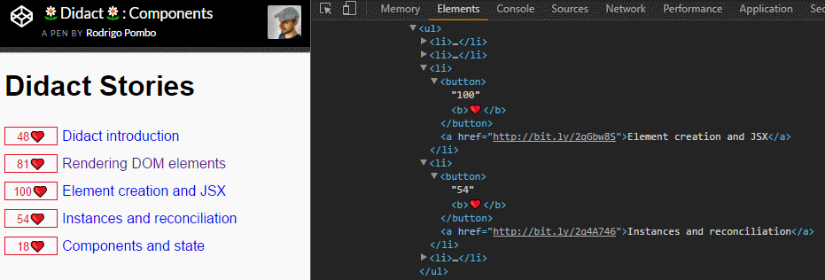

## 4. 组件和状态

> 这个故事是我们逐步构建我们自己版本的React系列的一部分：

[该代码](https://codepen.io/pomber/pen/WjLqYW?editors=0010)在--[过去](#实例-对比和虚拟DOM)后有一些问题：

- 每次更改都会触发完整虚拟DOM树上的对比

- `State`是-global-的

- 我们需要`render`在更改状态后-显式调用该函数

组件帮助我们解决这些问题，并让我们：

- 为`JSX`定义我们自己的“tags”

- 钩住「生命周期」lifecyle事件（不包含在这篇文章中）

首先我们需要提供`Component`组件将要扩展的基类。我们需要一个带`props`参数和`setState`方法的构造函数，

它接收一个`partialState`我们将用来更新组件状态的方法：

``` js
// es6 写法
class Component {
  constructor(props) {
    this.props = props;
    this.state = this.state || {};
  }

  setState(partialState) {
    this.state = Object.assign({}, this.state, partialState);
  }
}
```

应用程序代码将扩展此类，然后使用其他类型的元素，例如`div`或`span`，使用：`<MyComponent/>`。

请注意，我们不需要在我们的`createElement`函数中改变任何东西，它将保持组件类作为`type`元素并`props`像往常一样处理。

我们确实需要一个创建组件实例的函数（我们将其称为`公共实例`）给定一个元素：

``` js
function createPublicInstance(element, internalInstance) {
  // 当 元素进到这里来, 说明
  // type 是 一个函数
  const { type, props } = element;
  // 新建-实例
  const publicInstance = new type(props);
  // 
  publicInstance.__internalInstance = internalInstance; // 
  return publicInstance;
}
```

除了创建`公共实例外`，我们还保留对触发组件实例化的-内部实例的引用-，我们需要它能够在`公共实例`-`状态更改`时仅-更新实例子树：

``` js
class Component {
  constructor(props) {
    this.props = props;
    this.state = this.state || {};
  }

  setState(partialState) {
    this.state = Object.assign({}, this.state, partialState);
    // 内部实例的引用
    updateInstance(this.__internalInstance); // 更新 虚拟-Dom树和 更新 html
  }
}

function updateInstance(internalInstance) {

  const parentDom = internalInstance.dom.parentNode;
  const element = internalInstance.element;

  reconcile(parentDom, internalInstance, element); // 对比-虚拟dom树
}
```

我们还需要更新该`instantiate`功能。对于组件，我们需要`createPublicInstance`并调用组件的`render函数`来获取我们将再次传递给它的`子元素instantiate`：

``` js
function instantiate(element) {
  const { type, props } = element;
  const isDomElement = typeof type === "string";
  //

  if (isDomElement) {
    // Instantiate DOM element
    // 初始化 Didact 元素
    const isTextElement = type === TEXT_ELEMENT;
    const dom = isTextElement
      ? document.createTextNode("")
      : document.createElement(type);

    updateDomProperties(dom, [], props);

    const childElements = props.children || [];
    const childInstances = childElements.map(instantiate);
    const childDoms = childInstances.map(childInstance => childInstance.dom);
    childDoms.forEach(childDom => dom.appendChild(childDom));

    const instance = { dom, element, childInstances };
    return instance;
  } else {
    // Instantiate component element 
    // 初始化 组件 <App />
    const instance = {};

    // createPublicInstance 
    // 1. 新建 newApp = new App() 
    // 2. newApp.__internalInstance = instance
    // 3. publicInstance = newApp
    const publicInstance = createPublicInstance(element, instance);
    // 
    const childElement = publicInstance.render(); // 自己定义的 渲染-render-函数

    const childInstance = instantiate(childElement); // 递归 孩子拿到 { dom, element, childInstances }
    const dom = childInstance.dom;

    Object.assign(instance, { dom, element, childInstance, publicInstance }); // >> 组件元素比Didact元素 多了本身- 实例
    return instance;
  }
}
```

`组件元素`和dom元素的内部实例是不同的。

组件内部实例只能有一个子（从中返回`render`），因此它们具有`该childInstance属性`而不是`childInstances实例具有的数组`。

另外，组件内部实例需要引用-`publicInstance`，以便`render`在对比过程中调用该函数。

唯一缺少的是处理组件实例对帐，因此我们会在对帐算法中再添加一个案例。

鉴于`组件实例`只能有一个孩子，我们不需要处理`children-协调`，我们只需更新`props`公共实例，重新呈现孩子并协调它：

``` js
// 对比-元素 并 更新 html
function reconcile(parentDom, instance, element) {
  if (instance == null) {
    // Create instance
    const newInstance = instantiate(element);
    parentDom.appendChild(newInstance.dom);
    return newInstance;
  } else if (element == null) {
    // Remove instance
    parentDom.removeChild(instance.dom);
    return null;
  } else if (instance.element.type !== element.type) {
    // Replace instance
    const newInstance = instantiate(element);
    parentDom.replaceChild(newInstance.dom, instance.dom);
    return newInstance;
  } else if (typeof element.type === "string") {
    // Update dom instance
    updateDomProperties(instance.dom, instance.element.props, element.props);
    instance.childInstances = reconcileChildren(instance, element);
    instance.element = element;
    return instance;
  } else {
    //Update composite instance
    // 更新-组件-

    // parentDom 真实-html-树
    // element Didact元素 新
    // instance  旧

    instance.publicInstance.props = element.props; // 更新-props
    const childElement = instance.publicInstance.render(); // 组件的render函数 
    const oldChildInstance = instance.childInstance;
    const childInstance = reconcile(parentDom, oldChildInstance, childElement); // 对比-剩下-孩子
    instance.dom = childInstance.dom; // 更新-dom
    instance.childInstance = childInstance; // 更新-虚拟dom数
    instance.element = element; // 更新-Didact元素
    return instance;
  }
}
```

就这样，我们现在支持组件。

---

先捋一捋:

分清有`-5-`种名称

1. 真实-html-树 
2. Didact 元素 `{type, props}`
3. 虚拟-Dom-树
  - 3.1 虚拟-dom-元素 `{ dom, element, childInstance }`
  - 3.2 虚拟-组件-元素 `{ dom, element, childInstance, publicInstance }`

---

- `createElement`

> 构建所谓的-Didact元素 `{type, props}`, 主要用于-JSx-语法糖-转换

- `createTextElement`

> 构建所谓的-文本类型-Didact元素 `{type:TEXT_ELEMENT, props}` 主要用于-JSx-语法糖-转换

- `render`

> 渲染-html,带有html元素进场。一切的开头, 接下来对比-虚拟dom树 // -- 1

- `reconcile` 

> - 需要虚拟dom树 没有？新建！ // -- 2  

> - 具有虚拟树后, 且再次触发 , 对比-虚拟dom树, 并加/减/替换/更新dom元素/更新组件元素 // -- 7

- `instantiate`

> 新建-虚拟-dom-元素/虚拟-组件-元素 // -- 3

- `createPublicInstance`

> 用于构建-组件元素的新建实例 // -- 4

- `updateDomProperties` 

> dom节点中删除所有`旧属性`，然后`添加`所有`新属性  // -- 5

- `updateInstance` 

> 用于-`this.setState`- 中->触发更新虚拟-dom-树 // -- 6

- `reconcileChildren` 

> 更新dom元素-子元素 , 递归触发-`reconcile` // -- 8

---


我已经更新了`codepen`从最后一次使用它们。应用程序代码如下所示：


``` js
const stories = [
  { name: "Didact introduction", url: "http://bit.ly/2pX7HNn" },
  { name: "Rendering DOM elements ", url: "http://bit.ly/2qCOejH" },
  { name: "Element creation and JSX", url: "http://bit.ly/2qGbw8S" },
  { name: "Instances and reconciliation", url: "http://bit.ly/2q4A746" },
  { name: "Components and state", url: "http://bit.ly/2rE16nh" }
];

class App extends Didact.Component {
  render() {
    return (
      <div>
        <h1>Didact Stories</h1>
        <ul>
          {this.props.stories.map(story => {
            return <Story name={story.name} url={story.url} />;
          })}
        </ul>
      </div>
    );
  }
}

class Story extends Didact.Component {
  constructor(props) {
    super(props);
    this.state = { likes: Math.ceil(Math.random() * 100) };
  }
  like() {
    this.setState({
      likes: this.state.likes + 1
    });
  }
  render() {
    const { name, url } = this.props;
    const { likes } = this.state;
    const likesElement = <span />;
    return (
      <li>
        <button onClick={e => this.like()}>{likes}<b>❤️</b></button>
        <a href={url}>{name}</a>
      </li>
    );
  }
}

Didact.render(<App stories={stories} />, document.getElementById("root"));
```

[>>> codepen](https://codepen.io/pomber/pen/RVqBrx?editors=0010)

使用组件使我们能够创建自己的“JSX标签”，封装组件状态，并仅在受影响的子树上运行协调算法：



[>> codepen](https://codepen.io/pomber/pen/RVqBrx)

最后一个[codepen](https://codepen.io/pomber/pen/RVqBrx)使用整个系列中的完整代码。您可以在此提交中[查看此帖子对Didact的更改。](https://github.com/hexacta/didact/commit/2e290ff5c486b8a3f361abcbc6e36e2c21db30b8)

谢谢阅读。
